<h1 align="center" style="font-weight: lighter"> 📚  WordWave - print and publishing website </h1>

**Backend-Repo:** <a href="https://github.com/khanhvi03/webtech-backend.git">https://github.com/khanhvi03/webtech-backend.git</a> 

## ⚙️ Structure
* **Frontend (Client-Side**): Vue (Framework) + TypeScript + Vue-Router + Bootstrap + Axios + Vitest (Testing) + Okta (Authorization/Authentication)
* **Backend (Server-Side)**: Spring Boot + PostgreSQL + Gradle (Testing)

## 🌟 Features
### 1. Submission Management:
* **Works Submission for Writer:** The submission page offers writers a user-friendly interface to submit their literary works. 
* **Submission Handling for Wordwave Editors**: Wordwave Editors can gain overview about writers' submission details through their dashboard.

### 2. Post Management:
* **Browse Posts:** At homepage readers can explore a curated collection of posts, displaying essential details like titles, authors, content, publication dates and updates.
* **Create Posts:** Wordwave Editors can compose new posts based on submissions by providing essential details such as titles, authors, and content through an intuitive interface.
* **Edit Posts:** Wordwave Editors can modify existing posts with simple editing tools, enabling updates to titles, authors, and content.
* **Delete Posts:** Wordwave Editors can manage content management by removing unwanted posts from the system.

### 3. Authentication for Wordwave Editors:
* **Registration/Login + Personalized Dashboard:** Wordwave Editors can register an account and have access to a personalized dashboard 
where they can manage their posts, submissions from writers, and profile information with ease.

## 📸 Preview
### Homepage
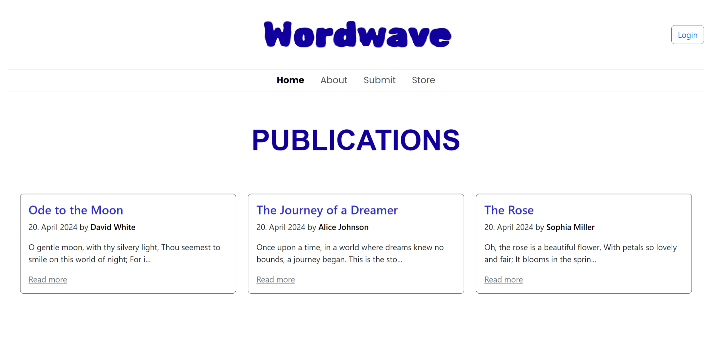

### Post Details
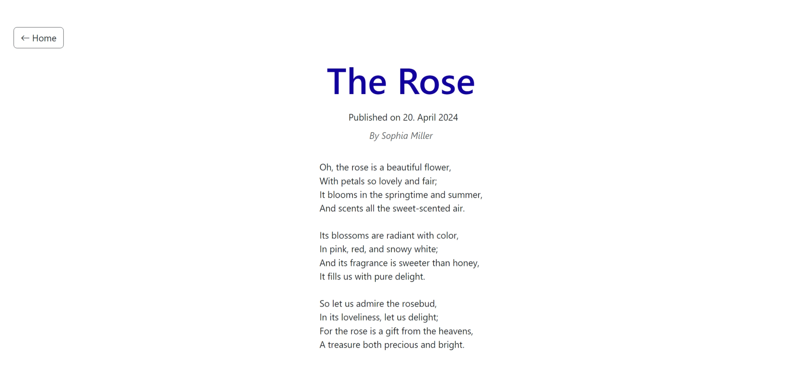

### About Page
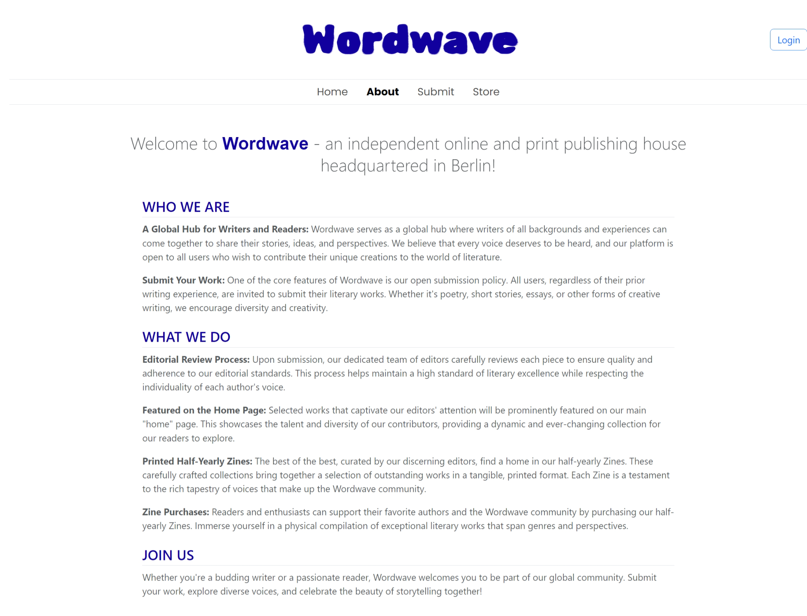

### Submit Page
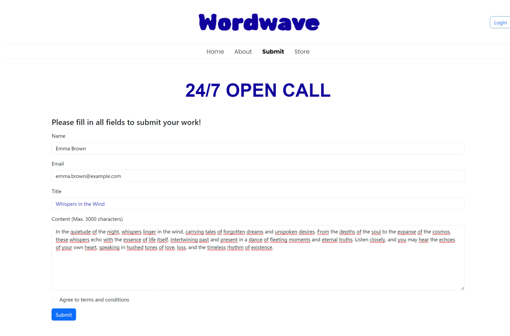

### Store Page
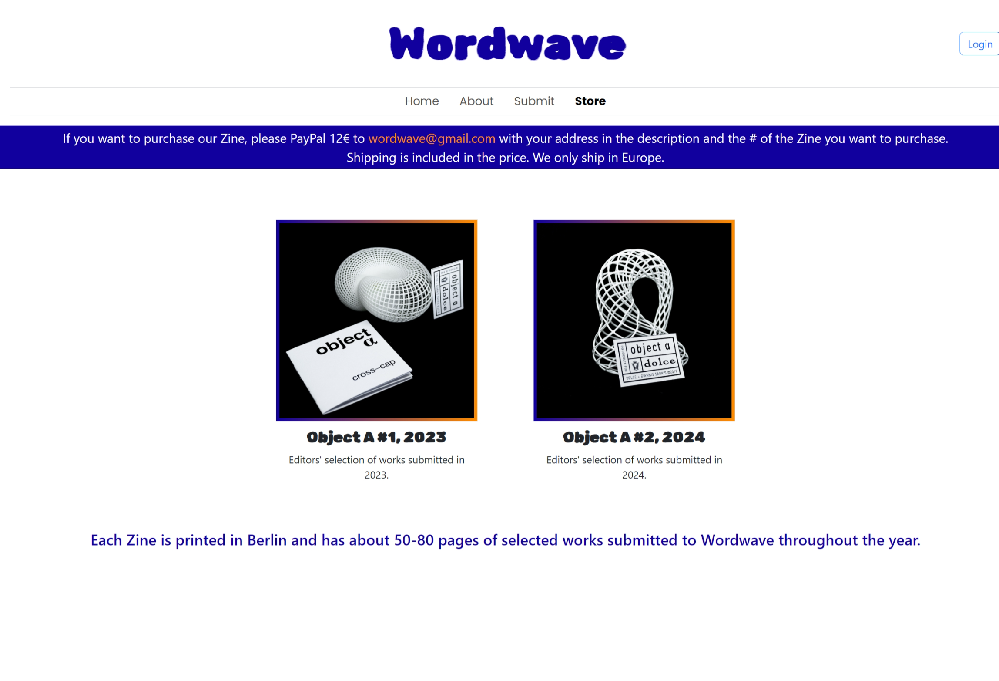

### Login
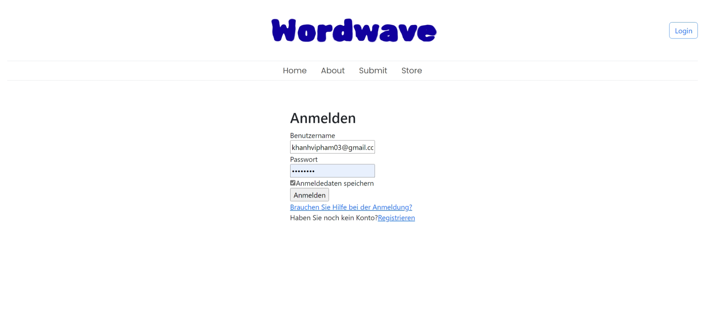

### Dashboard
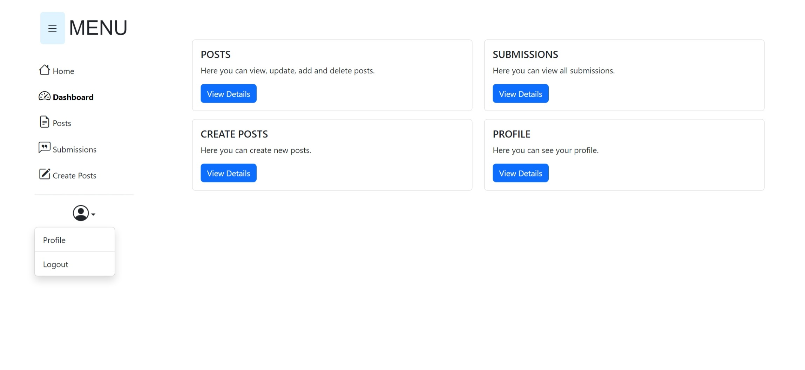

### Submissions
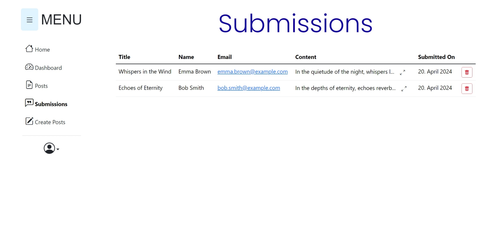

### Posts
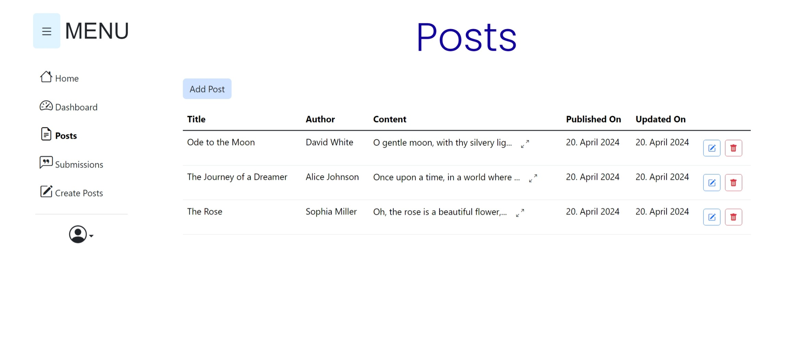

### Add Posts
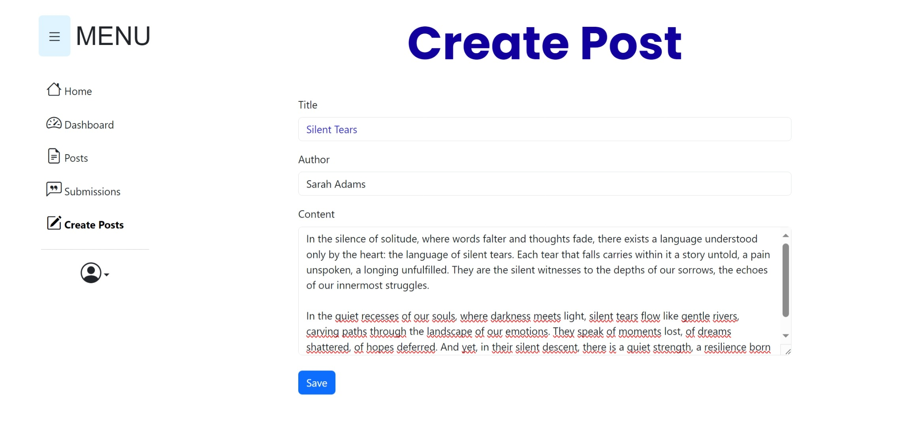

### Profile
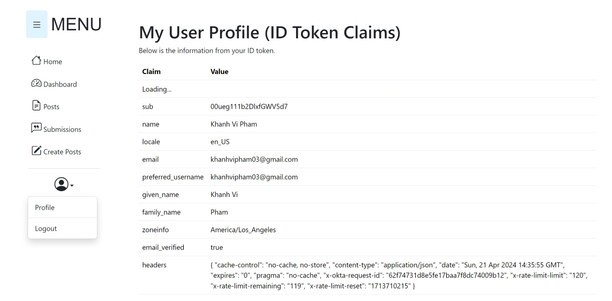

## 🚀 Deploy
* Backend: https://wordwave-backend.up.railway.app
* Frontend: https://wordwave-frontend.netlify.app
  or set in .env.development: VITE_BACKEND_BASE_URL=https://wordwave-backend.up.railway.app
  and use `npm run dev` in terminal
  
